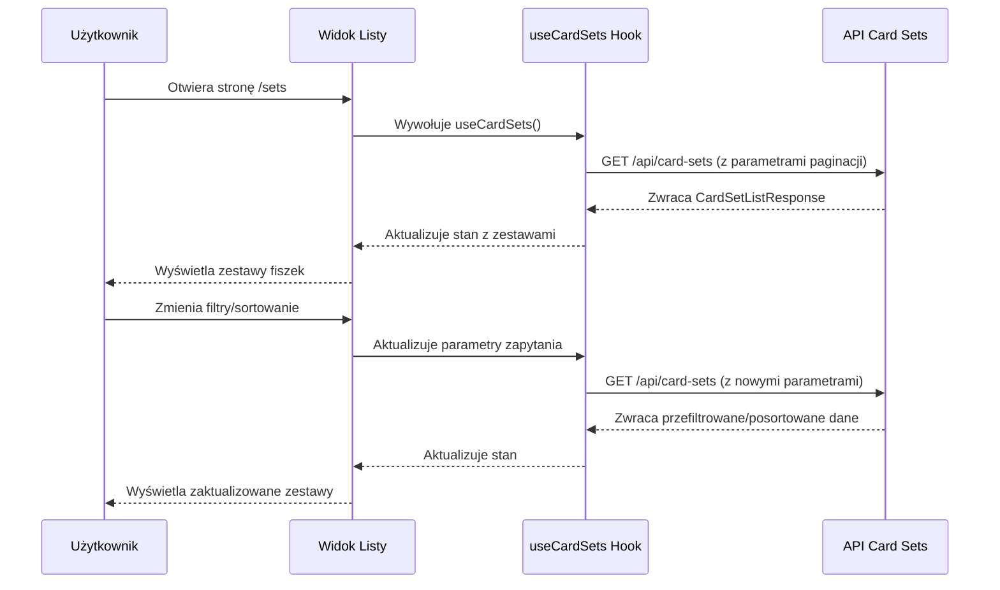
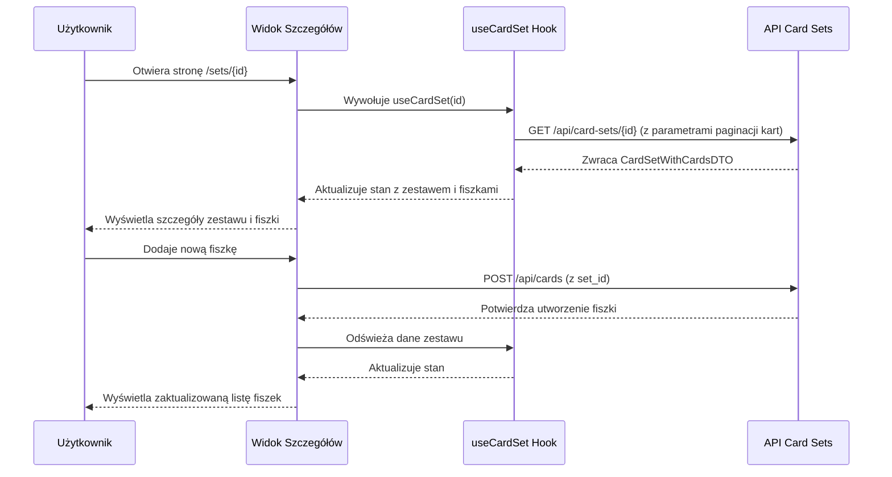
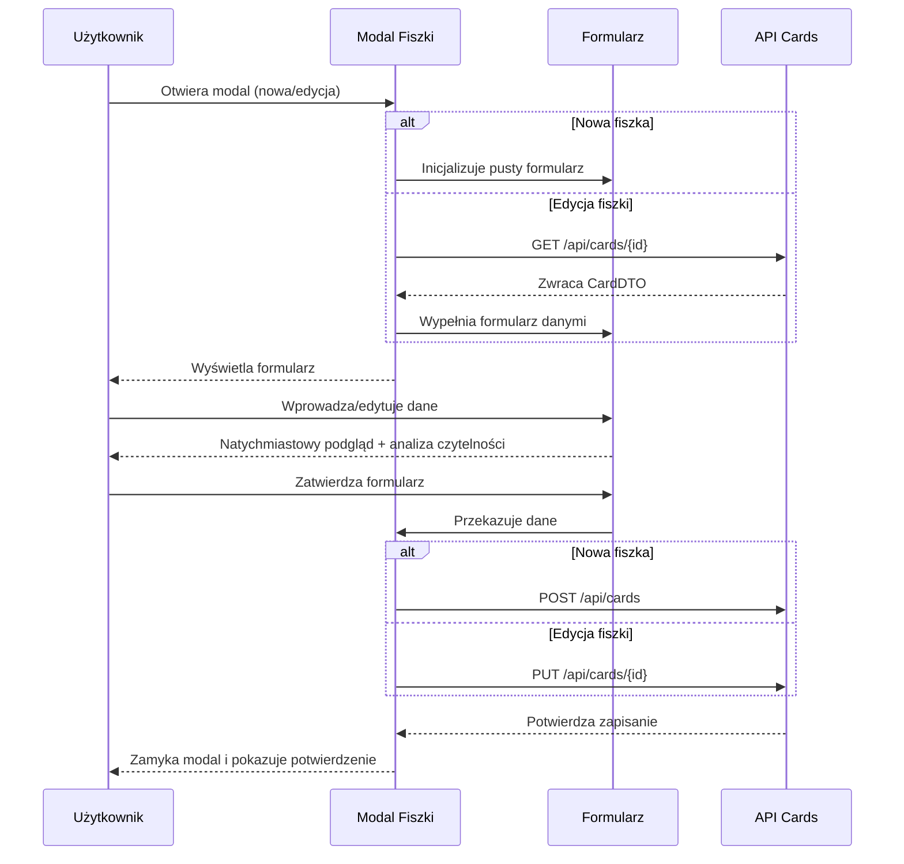

# Plan Implementacji Widoków Zarządzania Zestawami Fiszek

## 1. Przegląd Implementacji

Niniejszy dokument zawiera szczegółowy plan implementacji trzech powiązanych ze sobą widoków do zarządzania zestawami fiszek:

1. **Lista Zestawów Fiszek** (`/sets`) - Widok wszystkich zestawów użytkownika z możliwością filtrowania i sortowania
2. **Szczegóły Zestawu Fiszek** (`/sets/{set_id}`) - Szczegółowy widok pojedynczego zestawu z listą fiszek
3. **Modal Edycji Fiszki** - Komponent modalny do tworzenia i edycji pojedynczych fiszek

Widoki te wspólnie realizują wymagania zawarte w historiach użytkownika US-002, US-009 i US-005, zapewniając intuicyjne zarządzanie zestawami fiszek oraz pojedynczymi fiszkami.

## 2. Architektura i Struktura Plików

### 2.1 Struktura Folderów

```
src/
  ├── components/
  │   ├── common/
  │   │   ├── PageHeader.tsx
  │   │   ├── FilterBar.tsx
  │   │   └── EmptyState.tsx
  │   ├── card-sets/
  │   │   ├── CardSetGrid.tsx
  │   │   ├── CardSetList.tsx
  │   │   ├── CardSetCard.tsx
  │   │   ├── CardSetActionsMenu.tsx
  │   │   ├── CardSetFilters.tsx
  │   │   ├── CreateCardSetModal.tsx
  │   │   ├── EditCardSetModal.tsx
  │   │   ├── CardSetHeader.tsx
  │   │   ├── CardList.tsx
  │   │   ├── CardItem.tsx
  │   │   └── CardActionsMenu.tsx
  │   └── cards/
  │       ├── CardModal.tsx
  │       ├── CardForm.tsx
  │       ├── CardPreview.tsx
  │       ├── CardReadabilityMeter.tsx
  │       └── CardPersonalizationOptions.tsx
  ├── hooks/
  │   ├── useCardSets.ts
  │   ├── useCardSet.ts
  │   ├── useCards.ts
  │   └── useCardPersonalization.ts
  ├── pages/
  │   ├── sets/
  │   │   ├── index.astro
  │   │   └── [id].astro
  │   └── api/
  │       └── ... (istniejące endpointy API)
```

### 2.2 Podejście Architektoniczne

Implementacja będzie oparta na następujących zasadach:

- **Podejście komponentowe** - Wykorzystanie małych, wielokrotnego użytku komponentów React
- **Rozdzielenie logiki od prezentacji** - Zastosowanie hooków React do zarządzania logiką i stanem
- **Dostępność i UX** - Zapewnienie dostępności z klawiatury i zgodności z WCAG 2.1
- **Responsywność** - Dostosowanie interfejsu do różnych rozmiarów ekranu
- **Wydajność** - Optymalizacja ponownego renderowania i operacji asynchronicznych

## 3. Widok Listy Zestawów Fiszek

### 3.1 Specyfikacja

- **Ścieżka URL**: `/sets`
- **Komponent główny**: `src/pages/sets/index.astro`
- **Komponenty podrzędne**:
  - `CardSetGrid` / `CardSetList` - dwa tryby wyświetlania zestawów
  - `CardSetFilters` - filtry i sortowanie
  - `CreateCardSetModal` - tworzenie nowego zestawu
  - `CardSetActionsMenu` - kontekstowe menu akcji dla zestawu

### 3.2 Funkcjonalność

- Wyświetlanie wszystkich zestawów fiszek użytkownika
- Przełączanie między widokiem siatki i listy
- Filtrowanie i sortowanie zestawów (według nazwy, daty, liczby fiszek)
- Tworzenie nowego zestawu fiszek
- Szybki dostęp do akcji dla zestawu (edycja, usunięcie, dodanie fiszek)
- Paginacja dużych zbiorów zestawów

### 3.3 Przepływ Danych



### 3.4 Komponenty UI

#### CardSetFilters

```tsx
// Fragment interfejsu komponentu
interface CardSetFiltersProps {
  filters: {
    search: string;
    sortBy: 'name' | 'created_at' | 'updated_at' | 'card_count';
    sortDirection: 'asc' | 'desc';
  };
  onFilterChange: (filters: Partial<CardSetFiltersProps['filters']>) => void;
}
```

#### CardSetGrid/CardSetList

```tsx
// Fragment interfejsu komponentu
interface CardSetGridProps {
  cardSets: CardSetWithCardCount[];
  isLoading: boolean;
  onEditClick: (id: string) => void;
  onDeleteClick: (id: string) => void;
  onViewClick: (id: string) => void;
}
```

### 3.5 Interakcje i Stany

| Stan | Opis | Komponenty UI |
|------|------|---------------|
| Ładowanie | Pobieranie danych z API | Skeleton + Spinner |
| Pusty | Brak zestawów fiszek | EmptyState z przyciskiem tworzenia |
| Wypełniony | Wyświetlanie zestawów | CardSetGrid/CardSetList |
| Tworzenie | Tworzenie nowego zestawu | CreateCardSetModal |
| Błąd | Błąd ładowania danych | Komunikat błędu z przyciskiem ponowienia |

### 3.6 Implementacja Responsywności

- Siatka: 3 kolumny (desktop) -> 2 kolumny (tablet) -> 1 kolumna (mobile)
- Przełączanie między widokiem siatki/listy automatyczne dla małych ekranów
- Uproszczone filtry dla widoku mobilnego z wysuwaną szufladą

## 4. Widok Szczegółów Zestawu Fiszek

### 4.1 Specyfikacja

- **Ścieżka URL**: `/sets/{set_id}`
- **Komponent główny**: `src/pages/sets/[id].astro`
- **Komponenty podrzędne**:
  - `CardSetHeader` - informacje o zestawie i główne akcje
  - `CardList` - lista fiszek w zestawie
  - `CardModal` - tworzenie/edycja fiszki
  - `EditCardSetModal` - edycja metadanych zestawu

### 4.2 Funkcjonalność

- Wyświetlanie szczegółów zestawu (nazwa, opis, liczba fiszek)
- Przeglądanie fiszek w zestawie z paginacją
- Dodawanie nowych fiszek do zestawu
- Edycja/usuwanie fiszek w zestawie
- Edycja metadanych zestawu
- Opcja rozpoczęcia nauki z wykorzystaniem zestawu

### 4.3 Przepływ Danych



### 4.4 Komponenty UI

#### CardSetHeader

```tsx
// Fragment interfejsu komponentu
interface CardSetHeaderProps {
  cardSet: CardSetDTO;
  cardCount: number;
  onEditClick: () => void;
  onDeleteClick: () => void;
  onAddCardClick: () => void;
  onStudyClick: () => void;
}
```

#### CardList

```tsx
// Fragment interfejsu komponentu
interface CardListProps {
  cards: CardDTO[];
  pagination: PaginationInfo;
  isLoading: boolean;
  onPageChange: (page: number) => void;
  onCardClick: (id: string) => void;
  onCardDeleteClick: (id: string) => void;
}
```

### 4.5 Interakcje i Stany

| Stan | Opis | Komponenty UI |
|------|------|---------------|
| Ładowanie | Pobieranie danych z API | Skeleton + Spinner |
| Pusty | Zestaw bez fiszek | EmptyState z przyciskiem dodania fiszki |
| Wypełniony | Wyświetlanie fiszek | CardList |
| Edycja Zestawu | Edycja metadanych zestawu | EditCardSetModal |
| Edycja Fiszki | Edycja pojedynczej fiszki | CardModal |
| Błąd | Błąd ładowania danych | Komunikat błędu z przyciskiem ponowienia |

### 4.6 Implementacja Zaawansowanych Funkcji

- Filtrowanie fiszek w zestawie (np. według zawartości, daty)
- Drag & drop do reorganizacji kolejności fiszek
- Szybki podgląd fiszki po najechaniu myszą
- Bulk actions (masowe dodawanie, usuwanie fiszek)

## 5. Modal Edycji Fiszki

### 5.1 Specyfikacja

- **Komponent główny**: `src/components/cards/CardModal.tsx`
- **Komponenty podrzędne**:
  - `CardForm` - formularz edycji treści fiszki
  - `CardPreview` - podgląd na żywo fiszki
  - `CardPersonalizationOptions` - opcje personalizacji
  - `CardReadabilityMeter` - wskaźnik czytelności

### 5.2 Funkcjonalność

- Tworzenie nowej fiszki
- Edycja istniejącej fiszki
- Podgląd na żywo zmian
- Opcje personalizacji (kolory, rozmiar tekstu)
- Wskaźnik czytelności treści
- Automatyczne zapisywanie zmian

### 5.3 Przepływ Danych



### 5.4 Komponenty UI

#### CardForm

```tsx
// Fragment interfejsu komponentu
interface CardFormProps {
  initialData?: Partial<CardDTO>;
  onSubmit: (data: CardUpdateCommand | CardCreateCommand) => Promise<void>;
  onCancel: () => void;
  setId?: string; // Opcjonalny ID zestawu przy tworzeniu
  isLoading: boolean;
}
```

#### CardPersonalizationOptions

```tsx
// Fragment interfejsu komponentu
interface CardPersonalizationOptionsProps {
  options: {
    textSize: 'small' | 'medium' | 'large';
    frontColor: string;
    backColor: string;
    fontFamily: string;
  };
  onChange: (options: Partial<CardPersonalizationOptionsProps['options']>) => void;
}
```

### 5.5 Interakcje i Stany

| Stan | Opis | Komponenty UI |
|------|------|---------------|
| Tworzenie | Tworzenie nowej fiszki | CardForm (pusty) |
| Edycja | Edycja istniejącej fiszki | CardForm (wypełniony) |
| Zapisywanie | Zapisywanie zmian | Przycisk Submit z indykatorem ładowania |
| Błąd | Błąd podczas zapisywania | Komunikat błędu |

### 5.6 Implementacja Zaawansowanych Funkcji

- Automatyczne zapisywanie co 3 sekundy po zmianie
- Tryb pełnoekranowy dla wygodniejszej edycji
- Rich text editing dla treści fiszki
- Deduplikacja treści (ostrzeżenie przy tworzeniu podobnej fiszki)

## 6. Hooki i Logika Biznesowa

### 6.1 useCardSets

```typescript
// Główna funkcjonalność hooka do zarządzania zestawami
function useCardSets(initialParams?: CardSetQueryParams) {
  const [params, setParams] = useState<CardSetQueryParams>(initialParams || { page: 1, limit: 10 });
  const [cardSets, setCardSets] = useState<CardSetWithCardCount[]>([]);
  const [pagination, setPagination] = useState<PaginationInfo>({ total: 0, page: 1, limit: 10, pages: 0 });
  const [isLoading, setIsLoading] = useState<boolean>(true);
  const [error, setError] = useState<string | null>(null);

  // Funkcje do pobierania, tworzenia, aktualizacji, usuwania zestawów
  const fetchCardSets = useCallback(async () => { /* ... */ }, [params]);
  const createCardSet = async (data: CardSetCreateCommand) => { /* ... */ };
  const updateCardSet = async (id: string, data: CardSetUpdateCommand) => { /* ... */ };
  const deleteCardSet = async (id: string) => { /* ... */ };

  // Efekt pobierania danych
  useEffect(() => {
    fetchCardSets();
  }, [fetchCardSets]);

  return {
    cardSets,
    pagination,
    isLoading,
    error,
    createCardSet,
    updateCardSet,
    deleteCardSet,
    setParams,
    refetch: fetchCardSets,
  };
}
```

### 6.2 useCardSet

```typescript
// Główna funkcjonalność hooka do zarządzania pojedynczym zestawem
function useCardSet(setId: string, initialCardParams?: CardQueryParams) {
  const [cardParams, setCardParams] = useState<CardQueryParams>(initialCardParams || { page: 1, limit: 10 });
  const [cardSet, setCardSet] = useState<CardSetDTO | null>(null);
  const [cards, setCards] = useState<CardDTO[]>([]);
  const [cardPagination, setCardPagination] = useState<PaginationInfo>({ total: 0, page: 1, limit: 10, pages: 0 });
  const [isLoading, setIsLoading] = useState<boolean>(true);
  const [error, setError] = useState<string | null>(null);

  // Funkcje do pobierania, aktualizacji zestawu i zarządzania fiszkami
  const fetchCardSet = useCallback(async () => { /* ... */ }, [setId, cardParams]);
  const updateCardSet = async (data: CardSetUpdateCommand) => { /* ... */ };
  const deleteCardSet = async () => { /* ... */ };
  const addCardToSet = async (cardId: string) => { /* ... */ };
  const removeCardFromSet = async (cardId: string) => { /* ... */ };

  // Efekt pobierania danych
  useEffect(() => {
    fetchCardSet();
  }, [fetchCardSet]);

  return {
    cardSet,
    cards,
    cardPagination,
    isLoading,
    error,
    updateCardSet,
    deleteCardSet,
    addCardToSet,
    removeCardFromSet,
    setCardParams,
    refetch: fetchCardSet,
  };
}
```

### 6.3 Obsługa Błędów

```typescript
// Przykład strategii obsługi błędów
const handleApiError = (error: unknown): string => {
  if (error instanceof Error) {
    // Standardowe błędy JS
    return error.message;
  }
  
  if (typeof error === 'object' && error !== null && 'status' in error) {
    // Błędy HTTP
    const httpError = error as { status: number; message?: string };
    
    switch (httpError.status) {
      case 401:
        return 'Musisz być zalogowany, aby wykonać tę operację';
      case 403:
        return 'Nie masz uprawnień do wykonania tej operacji';
      case 404:
        return 'Zasób nie został znaleziony';
      case 500:
        return 'Wystąpił wewnętrzny błąd serwera';
      default:
        return httpError.message || 'Wystąpił nieznany błąd';
    }
  }
  
  return 'Wystąpił nieznany błąd';
};
```

## 7. Plan Implementacji

### 7.1 Etapy i Priorytety

1. **Etap 1: Podstawowa struktura i routing**
   - Implementacja stron Astro i podstawowych komponentów
   - Konfiguracja routingu i nawigacji między widokami
   
2. **Etap 2: Widok listy zestawów (podstawowa funkcjonalność)**
   - Implementacja `useCardSets` hook do pobierania danych
   - Stworzenie komponentów CardSetGrid/CardSetList
   - Podstawowe filtrowanie i sortowanie
   
3. **Etap 3: Widok szczegółów zestawu (podstawowa funkcjonalność)**
   - Implementacja `useCardSet` hook
   - Wyświetlanie metadanych zestawu i listy fiszek
   - Paginacja fiszek
   
4. **Etap 4: Modal edycji fiszek**
   - Formularz tworzenia/edycji fiszki
   - Podgląd na żywo
   - Podstawowa personalizacja
   
5. **Etap 5: Zaawansowane funkcje i optymalizacje**
   - Rozszerzenie personalizacji fiszek
   - Implementacja drag & drop
   - Optymalizacja wydajności
   - Zaawansowane filtrowanie

### 7.2 Harmonogram Czasowy

| Etap | Szacowany czas | Opis |
|------|----------------|------|
| Etap 1 | 1 dzień | Podstawowa struktura projektu i routing |
| Etap 2 | 2 dni | Widok listy zestawów |
| Etap 3 | 2 dni | Widok szczegółów zestawu |
| Etap 4 | 2 dni | Modal edycji fiszek |
| Etap 5 | 3 dni | Zaawansowane funkcje i optymalizacje |
| Testowanie | 2 dni | Testy manualne i automatyczne |
| Poprawki | 1 dzień | Naprawianie znalezionych błędów |

**Łączny szacowany czas implementacji: 13 dni roboczych**

### 7.3 Zależności i Blokery

- Zależność od API endpoints - wymagana implementacja wszystkich endpointów API przed ukończeniem etapów 2-5
- Zależność od systemu uwierzytelniania - wymagana implementacja autentykacji przed integracją z API
- Potencjalny bloker: wydajność przy dużej liczbie fiszek - może wymagać optymalizacji w etapie 5

## 8. Testy i Zapewnienie Jakości

### 8.1 Strategia Testowania

- **Testy jednostkowe**: Testy hooków i logiki biznesowej (Vitest)
- **Testy komponentów**: Testy poszczególnych komponentów React (React Testing Library)
- **Testy integracyjne**: Testowanie interakcji między komponentami
- **Testy E2E**: Testy pełnych przepływów użytkownika (Playwright)

### 8.2 Przypadki Testowe dla Widoku Listy Zestawów

1. Wyświetlanie listy zestawów po załadowaniu strony
2. Zmiana trybu wyświetlania (siatka/lista)
3. Filtrowanie i sortowanie zestawów
4. Tworzenie nowego zestawu fiszek
5. Edycja i usuwanie zestawu fiszek
6. Przechodzenie do widoku szczegółów zestawu
7. Paginacja przy dużej liczbie zestawów
8. Obsługa stanu pustego (brak zestawów)
9. Obsługa błędów API

### 8.3 Przypadki Testowe dla Widoku Szczegółów Zestawu

1. Wyświetlanie szczegółów zestawu i listy fiszek
2. Edycja metadanych zestawu
3. Dodawanie nowej fiszki do zestawu
4. Edycja i usuwanie fiszki
5. Paginacja fiszek
6. Obsługa stanu pustego (brak fiszek w zestawie)
7. Obsługa błędów API

### 8.4 Przypadki Testowe dla Modalu Edycji Fiszki

1. Otwarcie modalu do tworzenia nowej fiszki
2. Otwarcie modalu do edycji istniejącej fiszki
3. Zapisywanie zmian w fiszce
4. Anulowanie edycji
5. Podgląd na żywo zmian
6. Personalizacja fiszki
7. Walidacja formularza
8. Obsługa błędów API

## 9. Wytyczne UX/UI

### 9.1 Ogólne Zasady Projektowe

- **Spójność**: Zachowanie spójności wizualnej i interakcyjnej we wszystkich widokach
- **Progresywne ujawnianie**: Pokazywanie zaawansowanych opcji tylko wtedy, gdy są potrzebne
- **Natychmiastowa informacja zwrotna**: Widoczna reakcja na akcje użytkownika
- **Przewidywalność**: Jasne i intuicyjne elementy interfejsu

### 9.2 Dostępność

- Zachowanie odpowiedniego kontrastu (min. 4.5:1 dla tekstu)
- Pełna obsługa z klawiatury
- Odpowiednie atrybuty ARIA
- Obsługa czytników ekranu
- Teksty alternatywne dla elementów graficznych

### 9.3 Responsywność

- Breakpointy: mobile (<640px), tablet (640px-1024px), desktop (>1024px)
- Dopasowanie układu do różnych rozmiarów ekranu
- Optymalizacja interakcji dla urządzeń dotykowych

### 9.4 Nawigacja

- Ścieżka "breadcrumb" dla łatwej nawigacji hierarchicznej
- Konsekwentny układ nawigacji w całej aplikacji
- Wyraźne zaproszenia do działania (Call to Action)
- Jasne komunikaty zwrotne po wykonaniu akcji

## 10. Rozszerzenia i Przyszłe Funkcjonalności

### 10.1 Potencjalne Rozszerzenia

- **Tryb nauki**: Integracja z systemem nauki fiszek
- **Statystyki**: Dane o wykorzystaniu zestawów i postępie nauki
- **Zaawansowana personalizacja**: Większy wybór opcji formatowania fiszek
- **Współdzielenie**: Udostępnianie zestawów między użytkownikami
- **Import/Export**: Możliwość importu i eksportu zestawów

### 10.2 Optymalizacje Wydajności

- Wirtualizacja list przy dużej liczbie fiszek
- Ładowanie progresywne danych
- Mechanizmy buforowania i cache
- Lazy loading komponentów

## 11. Podsumowanie

Plan implementacji widoków zarządzania zestawami fiszek obejmuje trzy kluczowe widoki: listę zestawów, szczegóły zestawu i modal edycji fiszki. Implementacja będzie podzielona na 5 etapów z szacowanym czasem realizacji 13 dni roboczych.

Główne wyzwania techniczne to zapewnienie wydajności przy dużej liczbie danych, implementacja zaawansowanych funkcji personalizacji oraz zapewnienie spójnego i dostępnego interfejsu użytkownika.

Implementacja będzie zgodna z historiami użytkownika US-002, US-009 i US-005, realizując ich wymagania dotyczące intuicyjnego zarządzania fiszkami i zestawami fiszek.
