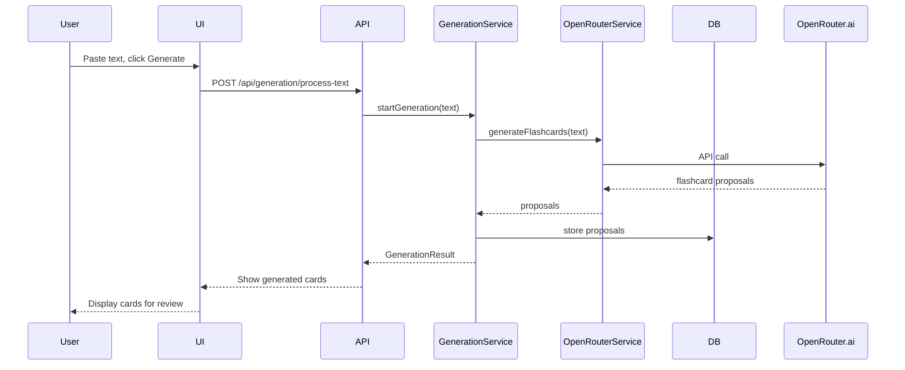
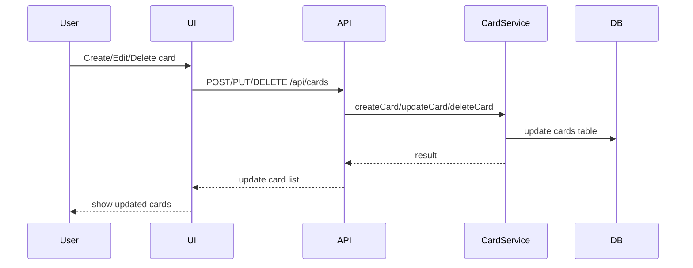
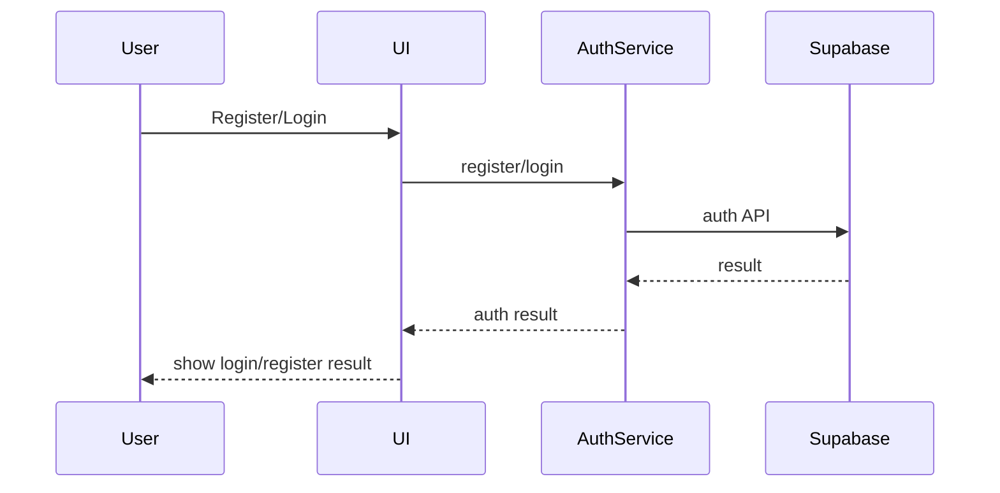
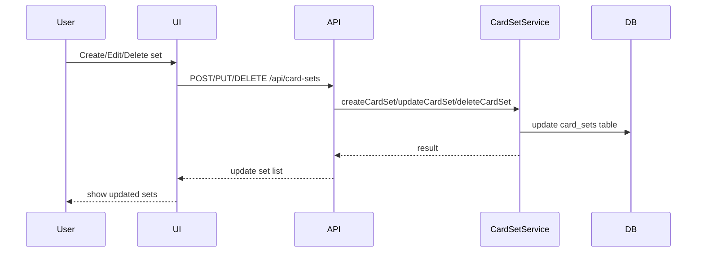
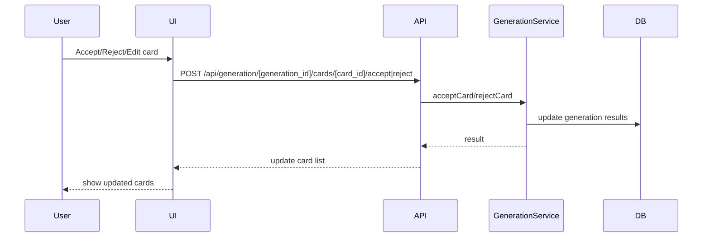
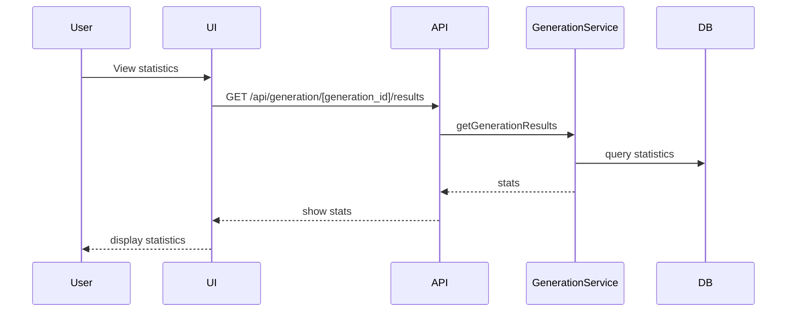
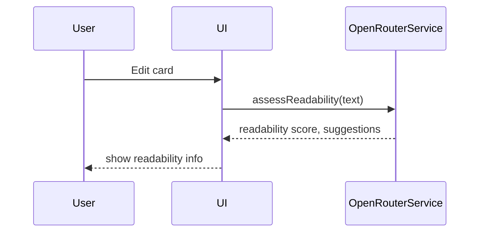
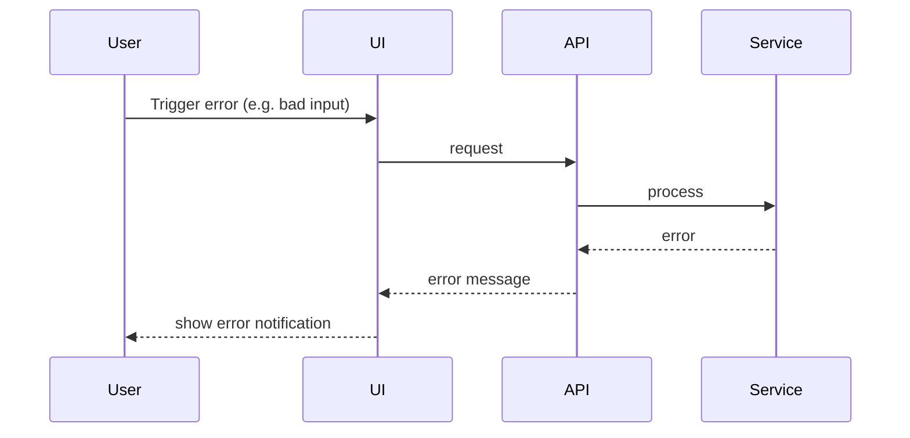
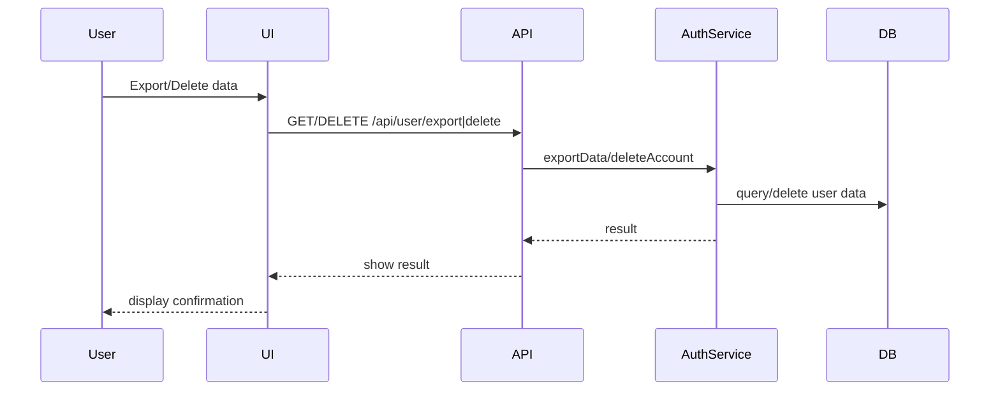
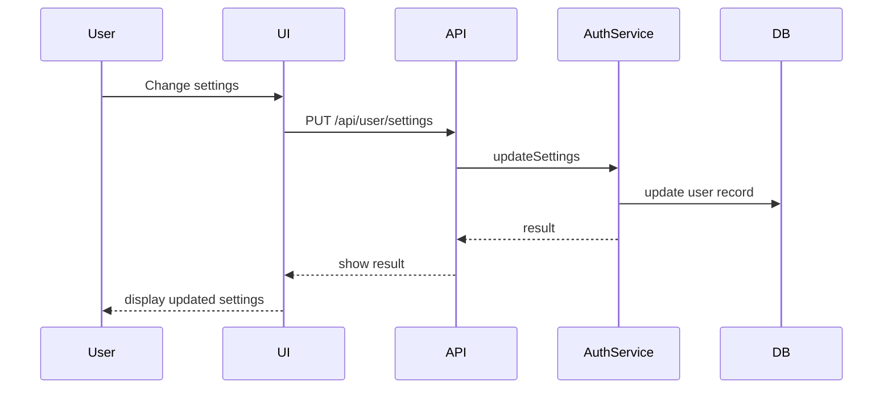

# 10xCards Sequence Diagrams

*For each use case, describe the main sequence of interactions (user, UI, service, DB, etc). Use Mermaid syntax for diagrams.*

## US-001: Automatic Flashcard Generation

## US-002: Manual Flashcard Management

## US-003: User Registration & Login

## US-009: Card Set Management

## US-006: Accept/Reject Generated Cards

## US-007: Generation Statistics

## US-008: Readability Assessment

## US-010: Error Handling for Generation

## US-011: Personal Data Management

## US-012: Account Settings & Preferences

---

*Diagrams for all main use cases, with planned/incomplete flows marked as needed.*
